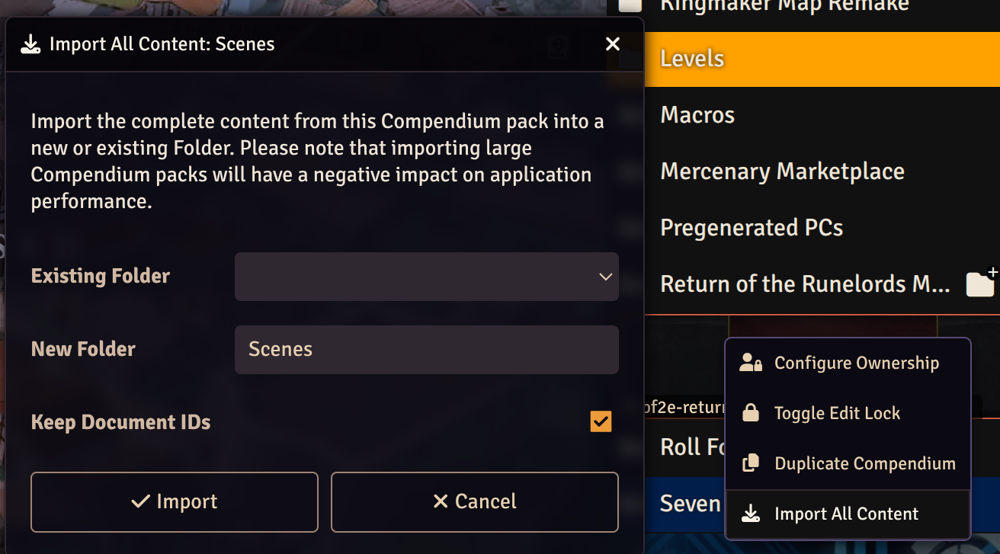

# Return of the Runelords Map Remake (Unofficial)

This module includes a map remake for Return of the Runelords under Paizo's CUP. The module is tuned for 2e, but should also work in 1e.

**Important**: When importing maps from the compendium, check **Keep Document IDs**, otherwise teleporters won't work! 



## License

All maps are licensed under Paizo's [CUP](https://paizo.com/licenses/communityuse)

> This FoundryVTT module uses trademarks and/or copyrights owned by Paizo Inc., used under Paizo's Community Use Policy (paizo.com/licenses/communityuse). We are expressly prohibited from charging you to use or access this content. This FoundryVTT module is not published, endorsed, or specifically approved by Paizo. For more information about Paizo Inc. and Paizo products, visit [paizo.com](paizo.com).

All Maps were [kindly provided](https://paizo.com/threads/rzs43u9i?Community-Created-Maps) by Vornn (Discord) and GoldSoul (Discord). If you want to donate to Vornn, [here's their ko-fi](https://ko-fi.com/vornn)

**GoldSoul's** maps include:

* Roderic's Cove - The Circle
* Magnimar - Gryphine Suite
* Magnimar - Ruins of Saint Sazzleru
* Korvosa - Kendall Plaza
* Jorgenfist
* Crystilan - The Timeworn Tunnel
* Crystilan - Rune Giant Territory
* Crystilan - Xin Edasseril Streets

**Vorrn's** maps make up the remaining portion

The maps were built using [Forgotten Adventure's Assets](https://www.forgotten-adventures.net/) and fall under their [Fan Content License](https://docs.google.com/document/d/1YVEXSHlePMtlD-CPAigBF_b_dX9AoLEDJt4mv0oVyvQ/edit?tab=t.0)

## Readaloud Text

This module supports read-aloud text. 2 Variants are supported:

* Read-aloud text on scene load
* Read-aloud text on regions

### Configuration

The module will look up a JSON file in **Data/pf2e-return-of-the-runelords-assets/voice-lines/SCENE_NAME/data.json** which has the following format:

```json
{
  "events": {
    "onload": "A1"
  },
  "lines": {
    "A1": "Example text posted to chat"
  }
}
```

**SCENE_NAME** is the name of the active scene with special characters stripped (any of: **'**)

The **event.onload** configuration will be run once the scene loads. The configuration values in **lines** can be run from a scene region script.

To do that, define a region in Foundry and give it the **Execute Script** behavior. Choose **Token Enters** as the Event and paste the following into the script box:

```js
// if you pass event.data.token, it will check if the token's actor type is either character or familiar and otherwise not activate
game.pf2eReturnOfTheRunelordsMapRemake.readaloudText('A1', behavior, event.data.token)
```

In either case, the value inside lines will be posted to chat. 

If a playlist exists with the name of the scene, the track with the same name as the key will be played as well (e.g. A1). Make sure to set the playlist to **Soundboard Only** and the **Audio Channel** to something other than **Music** so players can crank it up.

Once a scene text has been read, it's checked off as read. To reset it for the active scene, run:

```js
game.pf2eReturnOfTheRunelordsMapRemake.resetSceneRead()
```

## Release a New Version

Set the following env variables:

* **FOUNDRY_RETURN_MAP_REMAKE_TOKEN**: Token [from the package website](https://foundryvtt.com/packages/pf2e-return-of-the-runelords-map-remake/edit)
* **GITHUB_TOKEN**: [Fine Grained Access Token](https://github.com/settings/personal-access-tokens) with permissions: **Metadata: read**, **Content: read and write**

Update the version **build.gradle.kts**

Run:

    ./gradlew foundryvttRelease